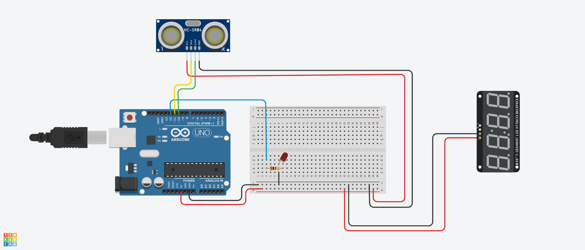

rust-arduino-blink
==================

Rust project for the _Arduino Uno_ using the ultrasonic distance sensor HC-SR04
and the TM1638 8-digit 7-segment display module.

## Build Instructions
1. Install prerequisites as described in the [`avr-hal` README] (`avr-gcc`, `avr-libc`, `avrdude`, [`ravedude`]).

2. Run `cargo build` to build the firmware.

3. Run `cargo run` to flash the firmware to a connected board.  If `ravedude`
   fails to detect your board, check its documentation at
   <https://crates.io/crates/ravedude>.

4. `ravedude` will open a console session after flashing where you can interact
   with the UART console of your board.

## Hardware
For this project, you will need the following components:
- Arduino Uno
- Breadboard
- 1 x led (LED1)
- 1 x 220Ω resistors 
- HC-SR04 ultrasonic distance sensor
- TM1638 8-digit 7-segment display module
- Jumper wires

The wiring connections are as follows:

##### ARDUINO UNO PINS:
D13 → built-in LED
D12 → LED2 (+ long leg) → 220Ω resistor → GND
D11 → HC-SR04 TRIG pin
D10 → HC-SR04 ECHO pin
D9  → TM1638 CLK pin
D8  → TM1638 DIO pin
D7  → TM1638 STB pin

##### POWER CONNECTIONS:
Arduino 5V → Breadboard + power rail
Arduino GND → Breadboard - power rail

#### HC-SR04:
VCC → + power rail
GND → - power rail

#### TM1638:
VCC → + power rail  
GND → - power rail

### Caster diagram

**Note:** tinkercad does not have the TM1638 module available, so the display is not shown in the diagram.

[`avr-hal` README]: https://github.com/Rahix/avr-hal#readme
[`ravedude`]: https://crates.io/crates/ravedude